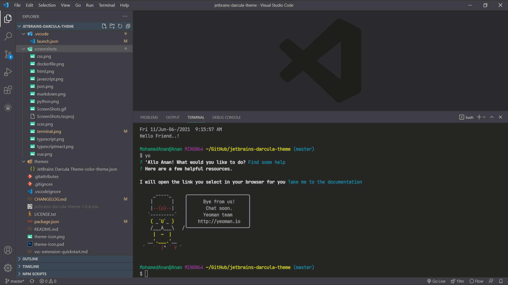

# JetBrains Darcula Theme for Visual Studio Code
[](https://vscode.dev/theme/zhuangtongfa.Material-theme)
[](https://vsmarketplacebadges.dev/installs-short/Anan.jetbrains-darcula-theme.png)
[](https://vsmarketplacebadges.dev/downloads-short/Anan.jetbrains-darcula-theme.png)
[](https://vsmarketplacebadges.dev/rating-star/Anan.jetbrains-darcula-theme.png)
[](https://vsmarketplacebadges.dev/version/Anan.jetbrains-darcula-theme.png)

A theme extension for Visual Studio Code based on Darcula theme from Jetbrains IDEs with some improvements.

## Sponsor
Please contact me if you are interested in becoming a sponsor!


## Installation
Launch VS Code Quick Open (Ctrl+P), paste the following command, and press enter.

```ext install Anan.jetbrains-darcula-theme```

or:
[Download from VisualStudio Marketplace](https://marketplace.visualstudio.com/items?itemName=Anan.jetbrains-darcula-theme)

## JetBrains Mono Font Installation
- Downloaded and install JetBrains Mono font https://www.jetbrains.com/lp/mono
- Add this snippet in your "settings.json":
  ```json
    "editor.fontFamily": "JetBrains Mono, Consolas, 'Courier New', monospace",
    "editor.fontSize": 13,
    "editor.lineHeight": 22,
    "editor.fontWeight": "300",
    ```

## Screenshots

[View All ScreenShots](screenshots)

## Tweaks & theming
If you want to play around with new colors, use the setting
`workbench.colorCustomizations` to customize the currently selected theme. For
example, you can add this snippet in your "settings.json" file:

```json
"workbench.colorCustomizations": {
  "tab.activeBackground": "#282c34",
  "activityBar.background": "#282c34",
  "sideBar.background": "#282c34"
}
```

or use the setting `editor.tokenColorCustomizations`

```json
"editor.tokenColorCustomizations": {
  "[JetBrains Darcula Theme]": {
    "textMateRules": [
      {
        "scope": ["source.python"],
        "settings": {
          "foreground": "#e06c75"
        }
      }
    ]
  }
}
```
### Enablement of semantic highlighting
By default [Semantic Highlighting](https://code.visualstudio.com/api/language-extensions/semantic-highlight-guide#enablement-of-semantic-highlighting) value is **false** in this theme, you can add this snippet in your "settings.json" file to disable it:
```json
"editor.semanticHighlighting.enabled": true
```

Please check the official documentation,
[Theme Color Reference](https://code.visualstudio.com/docs/getstarted/theme-color-reference) and
[Theme Color](https://code.visualstudio.com/docs/getstarted/themes), for more helpful information.

[More info](https://code.visualstudio.com/updates/v1_15#_user-definable-syntax-highlighting-colors)


## Syntax Support
Python, Javascript, TypeScript, React, Vue, HTML, Markdown, JSON, CSS, SCSS, Dockerfile, Go, and more...


## Contribution
If you want to add more syntax support or have any idea to improve highlighting, feel free to make a pull request or open a new issue.


## Inspiration
[One Dark Pro](https://github.com/Binaryify/OneDark-Pro), [PyCharm Theme](https://github.com/nicohlr/vscode-pycharm-theme), [JetBrains](https://www.jetbrains.com), [PyCharm](https://www.jetbrains.com/pycharm/), [WebStorm](https://www.jetbrains.com/webstorm/)


## Changelog
[CHANGELOG](CHANGELOG.md)


## License
This project is licensed under the MIT License - see the
[MIT](LICENSE.txt) file for details.


---

**Enjoy!**
